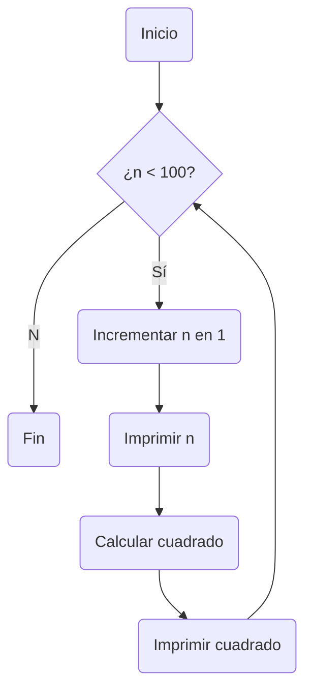
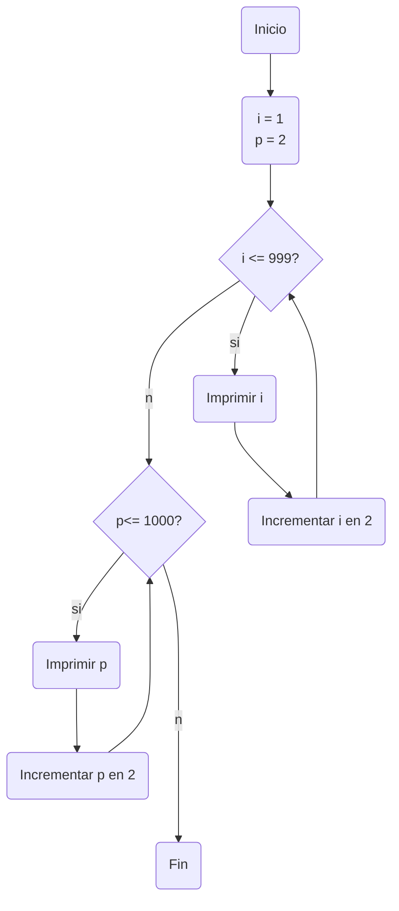
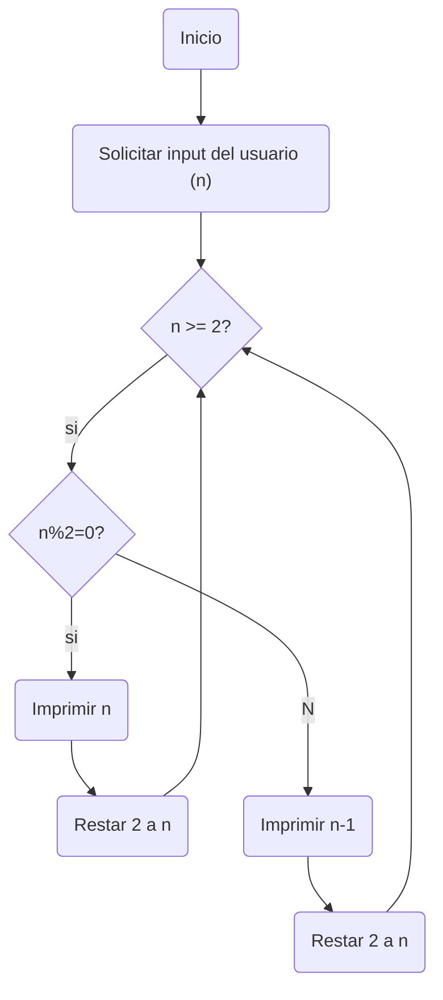

# Reto 7
### Julian Jacobo Gustin Moreno

***

### 1. Imprimir un listado con los números del 1 al 100 cada uno con su respectivo cuadrado.
```python
# imprimir un listado con los números del 1 al 100 y su respectivo cuadrado 

n : int = 0 #Inicializa a n en 0 

# Inciar el codigo 

if __name__ == "__main__": 
    while n < 100: #Mientras sea menor a 100 
        n += 1 #Suma 1 en cada iteracion 
        print(n) 
        m = n**2 # Elevar n al cuadrado
        print("Cuadrado de", str(n), ":", str(m))

```

***
### 2. Imprimir un listado con los números impares desde 1 hasta 999 y seguidamente otro listado con los números pares desde 2 hasta 1000.
```python
#Imprimir un listado de números impares desde 1 hasta 999, y después un listado con los números pares desde 2 hasta 1000

i : int = 1 
p : int = 2

# Inciar el codigo 

if __name__ == "__main__": 
    print ("Lista de numeros impares desde 1 hasta 999")
    while i <= 999: #Mientras i sea menor o igual a 999
        print (str(i))
        i += 2 #Añadir 2 en cada iteracion
    print ("Lista de numeros pares desde 2 hasta 1000")
    while p <= 1000:
        print (str(p))
        p += 2 
```


***
### 3. Imprimir los números pares en forma descendente hasta 2 que son menores o iguales a un número natural n ≥ 2 dado

```python
# Imprimir los numeros pares en forma descendente hasta 2 que son menores o iguales a un numero natural n >= 2 dado 

# Inciar el codigo 

if __name__ == "__main__": 
    n = int(input("Ingrese un número natural mayor a 2: ")) #Solicitar input del usuario
    while n >= 2: 
        prueba = n%2 # Verificar si el input es par o inpar
        if prueba == 0: #Codigo normal
            print(str(n))
            n -= 2
        else:
            print(n-1) # Restar 1 a n para que sea par
            n -= 2
```


***
### 4. En 2022 el país A tendrá una población de 25 millones de habitantes y el país B de 18.9 millones. Las tasas de crecimiento anual de la población serán de 2% y 3% respectivamente. Desarrollar un algoritmo para informar en que año la población del país B superará a la de A.
```python
# En 2022 el país A tendrá una población de 25 millones de habitantes 
# y el país B de 18.9 millones. Las tasas de crecimiento anual de la población serán de 2% y 3% respectivamente. 
# Desarrollar un algoritmo para informar en que año la población del país B superará a la de A.

year : int = 2022 
A : int = 25000000
B : int = 18900000

# Iniciar programa 

if __name__ == "__main__": 
    while A > B: 
        # Sumar a A y a B su porcentaje de crecimiento 
        A += A*0.02 
        B += B*0.03
        year += 1 #Sumar 1 al año 
    print ("El pais B superara en poblacion al pais A en el año", str(year), "Con poblaciones de", int(B), "y", int(A), "respectivamente" )
```
***
### 5. Imprimir el factorial de un número natural n dado
```python
#Imprimir el factorial de un numero n dado

#Iniciar el codigo 

if __name__ == "__main__": 
    n = int(input("Ingrese un número natural menor a 1558: ")) #Debe ser menor a 1558, pues hay un limite de caracteres en el resultado obtenido
    factor = n - 1  
    m = n #Separar m y n para poder imprimir el numero inicial al final
    while factor > 0: 
        m *= factor 
        factor -= 1 #Restar 1 al factor para multiplicarlo a m
    print("El factorial de", str(n), "es", str(m))
```
***
### 6. Implementar un algoritmo que permita adivinar un número dado de 1 a 100, preguntando en cada caso si el número es mayor, menor o igual.
```python
# Implementar un algoritmo que permita adivinar un número dado de 1 a 100, preguntando en cada caso si el número es mayor, menor o igual.
# Definir variables
minimo : int = 1
maximo : int = 100 
respuesta : str = ""

#Iniciar codigo 

if __name__ == "__main__": 

    while respuesta != "si": # Hasta que la respuesta no sea si
        adiv = (minimo + maximo) // 2 #Punto medio entre el maximo y el minimo
        respuesta = input(f"Tu numero es {adiv}? (si, mayor, menor):")
        if respuesta == "mayor": 
            minimo = adiv + 1 #Actualizar el valor minimo
        elif respuesta == "menor": 
            maximo = adiv - 1 #Actualizar el valor maximo
        else: 
            print("Adivine tu numero, y es", str(adiv))
```
***
### 7. Implementar un programa que ingrese un número de 2 a 50 y muestre sus divisores.
```python
#Implementar un programa que ingrese un número de 2 a 50 y muestre sus divisores.

divisor : int = 1 

#Iniciar codigo 

if __name__ == "__main__": 
    numero = int(input("Ingrese un numero entre 2 y 50: "))
    if numero >= 2 and numero <=50: #Si el numero esta entre 2 y 50
    
        print (f"Los divisores de {numero} son: ") 

        #Evaluar los divisores de un numero de 1 a 1 con modulo
        while divisor <= numero: 
            s = numero % divisor 
            if s == 0: 
                print(divisor)
            divisor +=1

    else:
        print ("Su numero no esta entre 2 y 50")
        
```
***
### 8. Implementar el algoritmo que muestre los números primos del 1 al 100. Nota: use funciones
```python
# Funcion que define si un numero es primo o no
def primo(n): 
    if n <= 1: # Los primos no pueden ser menores o iguales a 1
        return False
    elif n <= 3: # El 2 y el 3 son primos
        return True
    elif n % 2 == 0 or n % 3 == 0: # Si un numero puede ser divisible entre 2 y 3 no es primo
        return False
    x = 5
    while x**2 <= n: # Si un numero tiene un divisor mayor a su raiz cuadrada, también tendra divisores menores a su raiz
        if n % x == 0 or n % (x+2) == 0: # Si el numero es divisible entre x o x+2, no es primo
            return False
        x += 6 # Se incrementa x en 6 para seguir el patron 6k ± 1 
    return True 

n : int = 1

#Iniciar codigo 

if __name__ == "__main__": 
    while n < 100:
        if primo(n):
            print(n)
        n +=1

```
